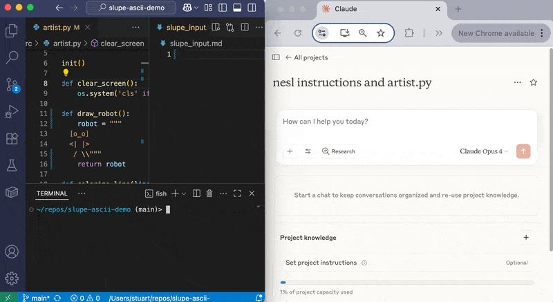

# ⛵️ Slupe 
### Sandboxed LLM oUtput processing engine

LLM coder 'tools' for any model

Slupe is a file system orchestration tool that enables LLMs to execute file operations through a custom syntax language called NESL (No Escape Syntax Language). It provides a secure, configurable bridge between AI assistants and your local development environment.

## Features

- **Universal LLM Compatibility**: Works with any LLM that can generate text
- **File System Operations**: Read, write, move, delete files with configurable access controls
- **Security Guards**: Configurable path-based access control with glob pattern support
- **Git Integration**: Optional hooks for automated commits and version control
- **Real-time Monitoring**: Watch input files for action changes and execute NESL blocks automatically
- **Clipboard Integration**: Optionally copies outputs directly to clipboard and monitor clipboard for input NESL blocks



## Installation

```bash
npm install -g slupe
```

or just 

```
npx slupe
```

Requirements:
- Node.js >= 20.0.0
- Git (optional, for version control hooks)

## Quick Start

1. Initialize Slupe in your project:
```bash
cd your-project
npx slupe
```

This creates:
- `slupe.yml` - Configuration file
- `slupe_input.md` - Input file for NESL commands
- `NESL_INSTRUCTIONS.md` - Instructions for LLMs

2. Share `NESL_INSTRUCTIONS.md` with an LLM along with any other relevant info from your file system, and ask it to make changes for you as nesl syntax.

3. Paste the whole output including NESL blocks into `slupe_input.md` and watch the execution results get prepended to the input file.

## NESL Syntax

NESL was designed to provide LLMs with a robust and conflict-free way to communicate payloads with minimal errors.  Tests have generally shown LLM-generated nesl to be more reliable that other compared formats including json (obviously), yaml, ruby heredocs, perl heredocs, and aider's git-conflict search/replace format.

```sh nesl
#!nesl [@three-char-SHA-256: x5t]
action = "file_write"
path = "/path/to/file.txt"
content = <<'EOT_x5t'
Hello, World!
This is multi-line content.
EOT_x5t
#!end_x5t
```

## Available Actions

### File Operations
- `file_read` - Read file contents
- `file_write` - Create or overwrite files
- `file_delete` - Delete files
- `file_move` - Move or rename files
- `file_replace_text` - Replace text in files (single occurrence)
- `file_replace_all_text` - Replace all occurrences of text
- `files_replace_all_text` - Replace text across multiple files
- `files_read` - Read multiple files at once

## Configuration

### slupe.yml

```yaml
# Slupe configuration
version: 1

# Allowed tools (required for security)
allowed-actions:
  - file_write
  - file_read
  - file_delete
  - file_move
  - file_replace_text
  - file_replace_all_text
  - files_read

# File system guard configuration
fs-guard:
  # Allowed paths (supports glob patterns)
  # Relative paths are resolved from this config file's location
  allowed:
    - "./**"           # All files in project
    - "/tmp/**"        # Temporary files
  
  # Denied paths (more specific rules override less specific)
  denied:
    - "**/.git/**"     # Git internals
    - "**/.ssh/**"     # SSH keys
    - "**/node_modules/**"  # Dependencies
  
  # Whether to follow symlinks (default: false)
  followSymlinks: false

# Git hooks configuration
hooks:
#  before: []
#  after: []


  # Example hooks
  # before:
  #   - run: git add -A
  #   - run: git commit -m "before ${COMMIT_MSG}"
  #   - run: git push
  #     timeout: 10000  # 10s for slow networks

  ## this creates a pushes a git commit with a helpful message
  # after:
  #   - run: |
  #       git add -A && 
  #       git commit -m "$(echo "auto-slupe:: $(git diff --cached --name-only | wc -l | tr -d ' ') files:\n$(git diff --cached --name-only | head -10)")" &&
  #       git push

  
# Variables available in commands
vars:
  COMMIT_MSG: "auto-slupe::"
  # Add more variables as needed

# Listener configuration
clipboard: false  # Enable clipboard copy on execution
input_file: slupe_input.md
output_file: .slupe_output.md

```

## Usage Modes

### 1. Interactive Mode (Default)
Start the listener and edit `slupe_input.md`:
```bash
slupe
```

### 2. Clipboard Mode
Enable clipboard integration:
```bash
slupe --clipboard
```

With clipboard mode enabled:
- Execution results are automatically copied to clipboard
- Slupe monitors your clipboard for NESL blocks
- When you copy two clipboard entries containing matching NESL delimiters (e.g., both containing `#!end_abc`), Slupe automatically executes the shorter entry

This enables a workflow where:
1. Copy the entire LLM response that includes NESL blocks.
2. Quickly (within 2 seconds) ctrl-a, ctrl-c the entire webpage to copy the whole thing including the recent response you just copied
3. Slupe detects and executes them automatically
4. Results are copied back to your clipboard

note: for reliable results, wait about half a second before doing the second copy.  Especially for large content that take the OS a bit to register

### 3. Command Line Options
```bash
slupe [options]

Options:
  --clipboard              Enable clipboard copy on execution
  --input_file <path>      Input file path (default: slupe_input.md)
  --output_file <path>     Output file path (default: .slupe_output.md)
  --help                   Show help message
```

## Slupe Squash

Slupe includes a git squashing utility for cleaning up commit history:

```bash
slupe-squash [options]

Options:
  --containing <string>   Match commits containing string (multiple=OR, ""=all)
                         Default: "auto-slupe::" if none specified
  --limit <number>       Max commits to squash from HEAD
  --after <date>         Only consider commits after ISO date
  --message <string>     Custom message (auto-generated if omitted)  
  --push                 Push to remote using --force-with-lease
  --force                With --push, use --force instead
  --dry-run              Preview without executing
  --help                 Show help
```

Examples:
```bash
# Squash all commits containing "WIP"
slupe-squash --containing "WIP"

# Squash last 5 commits with any message
slupe-squash --containing "" --limit 5

# Squash and push with custom message
slupe-squash --message "Feature: Add authentication" --push
```

The squash tool:
- Finds commits matching your criteria
- Combines them into a single commit
- Preserves the complete file change history
- Can automatically push changes with lease protection

## Security

Slupe implements multiple security layers:

1. **Action Allowlist**: Only explicitly allowed actions can be executed
2. **Path Guards**: Fine-grained control over file system access
3. **No Shell Expansion**: Commands are executed safely without shell interpretation

## LLM Integration

To use Slupe with your LLM:

1. Include the generated `NESL_INSTRUCTIONS.md` in your LLM prompt
2. Ask the LLM to generate NESL blocks for file operations
3. Copy the LLM's response to `slupe_input.md` or use clipboard mode

Example prompt:
```
Read the NESL_INSTRUCTIONS.md file and help me create a Python script 
that calculates fibonacci numbers. Use NESL blocks to write the file.  My cwd is /Users/path/to/dir
```

## Development

```bash
# Clone the repository
git clone https://github.com/stuartcrobinson/slupe.git
cd slupe

# Install dependencies
npm install

# Run tests
npm test

# Run in development mode
npm run dev
```

## Architecture

Slupe is built with a modular component architecture:

- **Parser** (`nesl-action-parser`): Parses NESL blocks into structured actions
- **Orchestrator** (`orch`): Coordinates execution and manages workflow
- **Executors**: Specialized handlers for different action types
  - `fs-ops`: File system operations
- **Guards** (`fs-guard`): Security and access control
- **Listener**: File watching and real-time execution
- **Squash**: Git history management utility

## Contributing

Contributions are welcome! Please feel free to submit a Pull Request.

## License

MIT © Stuart Robinson
